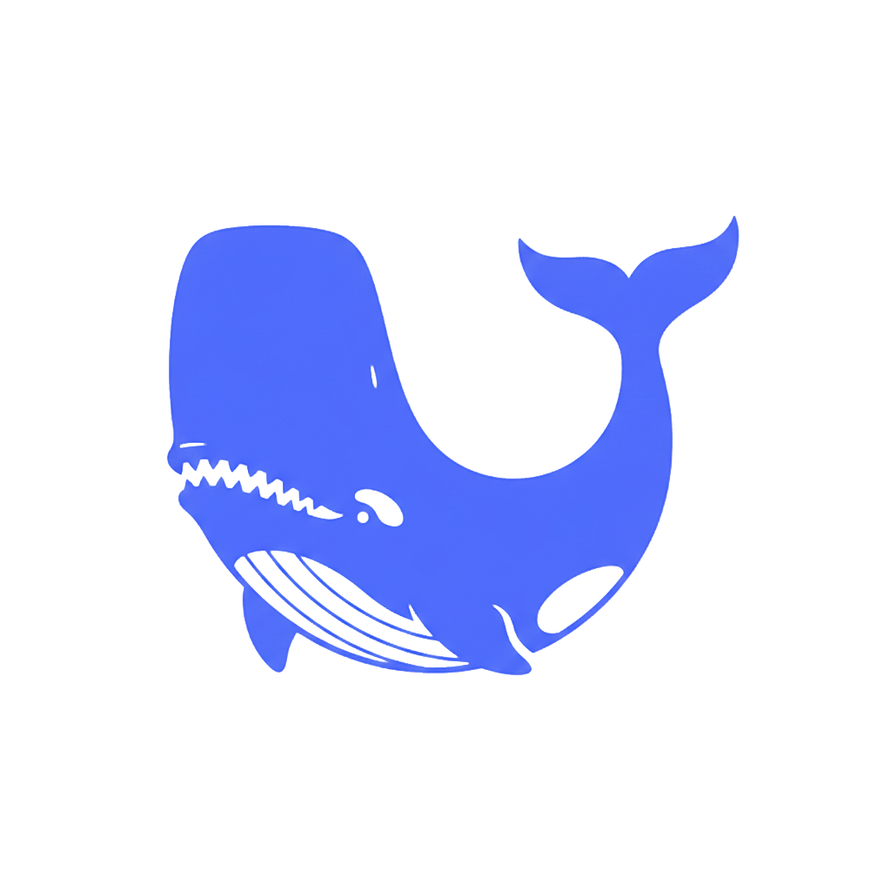

<p align="center">
  
</p>

<h1 align="center">DeepSeek Moby</h1>
<h2 align="center">v0.7.0</h2>

<p align="center">
  <strong>An AI coding assistant for VS Code.</strong>
  <br />
  Chat, edit, run commands, search the web, see images — with DeepSeek's models or any OpenAI-compatible endpoint, hosted or fully local.
</p>

<p align="center">
  <a href="#quick-start">Quick Start</a> &middot;
  <a href="#features">Features</a> &middot;
  <a href="#configuration">Configuration</a> &middot;
  <a href="#commands">Commands</a> &middot;
  <a href="#troubleshooting--faq">FAQ</a> &middot;
  <a href="#under-the-hood">Under the Hood</a>
</p>

<p align="center">
  <sub><em>Validated primarily on the maintainer's development environment — coverage across OSes, VS Code versions, and model configurations is still expanding. Reproducible bug reports are very welcome on the <a href="https://github.com/LoganBresnahan/DeepSeek-Moby/issues">issue tracker</a>.</em></sub>
</p>

---

<p align="center">
  
</p>

---

## Quick Start

### 1. Install

**From VSIX:** download the `.vsix` for your platform from [Releases](https://github.com/LoganBresnahan/DeepSeek-Moby/releases), then in VS Code: Extensions view → `...` menu → **Install from VSIX...**

**From source:**
```bash
git clone https://github.com/LoganBresnahan/DeepSeek-Moby.git
cd DeepSeek-Moby
npm install
npm run package                  # production build
npx @vscode/vsce package         # produces the .vsix
# install the .vsix as above, or press F5 to run it in a dev host
```

**Windows only:** install [Git for Windows](https://git-scm.com/download/win) — Moby runs AI-generated shell commands through Git Bash. Linux/macOS use the system shell as-is.

### 2. Connect a model

Pick either path — a DeepSeek account is **not** required if you bring your own model.

**Option A — DeepSeek:** get a key from [platform.deepseek.com](https://platform.deepseek.com), then run **DeepSeek Moby: Set API Key** from the Command Palette (`Ctrl+Shift+P`). For CI or headless setups, `export DEEPSEEK_API_KEY="sk-..."` works too — SecretStorage is checked first, environment second.

**Option B — your own model (local or hosted):** run **DeepSeek Moby: Add Custom Model** and pick a template — Ollama, LM Studio, llama.cpp, vLLM, OpenAI, Kimi, Gemini, GLM, Groq, OpenRouter — or point it at any OpenAI-compatible endpoint. Local models need no API key at all. Full walkthroughs: [docs/guides/custom-models.md](docs/guides/custom-models.md).

### 3. Chat

Click the Moby whale in the activity bar, type, press Enter. Two decisions worth making early:

- **Edit mode** (toolbar button): `manual` — you review and apply every change; `ask` — diffs open side-by-side for confirm/reject; `auto` — changes apply immediately with a safety net. Start with `ask`.
- **Web search** defaults to auto (the model decides when to search) but needs a backend — a [Tavily](https://tavily.com) key or a self-hosted SearXNG instance. Without one it stays quietly off.

---

## Features

### Agentic coding

The model doesn't just answer — it reads your files, searches your workspace, navigates code by symbol, runs shell commands, and edits, all mid-conversation as it reasons.

| Model | Best for | Context | Max output |
|-------|----------|---------|------------|
| **DeepSeek V4 Pro** *(default)* | Hardest problems — multi-step agentic work, large refactors | 1M tokens | 384K tokens |
| **DeepSeek V4 Flash** | Cheap reasoning — exploration, planning, lighter tasks | 1M tokens | 384K tokens |
| DeepSeek Chat (V3) | Legacy fast tier, no reasoning | 128K tokens | 8K tokens |
| DeepSeek Reasoner (R1) | Legacy chain-of-thought, shell-driven | 128K tokens | 64K tokens |

- Reasoning streams live in expandable **Thinking** dropdowns; tool calls dispatch inline as the model emits them
- **Every shell command needs your approval** before it runs — allow/block once or permanently, with an editable rule list. (An "Allow All Commands" override exists for the brave.)
- **LSP-backed navigation** — where VS Code's "Go to Definition" works, the model gets symbol-level tools instead of grepping blind: `outline`, `find_symbol`, `find_definition`, `find_references`, `get_symbol_source`, `hover` for a resolved type signature, and `get_diagnostics` to check whether an edit actually compiled. Availability is probed per language and declared to the model up front, and it uses your installed language extensions — nothing extra to install
- **Extensible via [MCP](#mcp-servers)** — point Moby at an MCP server and its tools join the same toolset
- **File context picker** — hand the model specific files yourself, independent of what it reads on its own
- Switching models starts a fresh session — no mixed-model conversations

*V3 and R1 remain available but are a generation behind; new work belongs on V4. R1 drives its agentic loop through inline `<shell>` tags rather than native tool calls — a deliberate design for models without tool-calling APIs, which is also what makes local text-only models workable.*

### Code edits you control

Three modes, switchable mid-session from the toolbar:

- **Manual** — diffs collect in a dropdown; you click Diff to inspect, Apply to write
- **Ask** — each change opens a side-by-side diff; confirm or reject
- **Auto** — changes apply immediately, listed in a Modified Files dropdown

Edits that can't be matched exactly are **refused, not force-applied** — the model re-reads and retries instead of corrupting your file. Auto mode adds a safety net: files are checkpointed before each edit, validated against your project's own build afterward, and reverted on regression. ([How it works.](docs/architecture/integration/edit-safety.md))

### Images

Attach a screenshot, ask about it, and the model answers — even though DeepSeek's API is text-only.

Moby gets there by routing, not pretending: a **vision model you configure** describes the image, and the main model reads that description, clearly labelled as second-hand. If no vision model is set up, the model says it cannot see the image and names the setting to fix — it never silently guesses.

- Attach via the **paperclip**, **drag-and-drop** onto the input box (OS file manager or VS Code Explorer), or the [phone drawing pad](#draw-from-your-phone). `.png`, `.jpg`, `.webp`, `.gif`, `.bmp`
- Images are **downscaled in your browser** before anything is sent or stored, so transcripts stay fast to load
- Descriptions **persist with the conversation** — reload or fork a session and the model still knows what the screenshot said; attached images render as thumbnails in the transcript

**Setup:** add a vision-capable model under custom models declaring `"acceptsImages": true` and `"subagentRoles": ["image-describe"]` — the **Kimi K3 (Moonshot)**, **Gemini** and **OpenAI** templates all do both — then select it under **Settings → Image Description (Vision)**. Any OpenAI-compatible vision endpoint works. Prefer a fast non-reasoning model for this role; if your provider has a thinking-off switch, declare it as `disableThinkingParam` (e.g. `{"enable_thinking": false}`) and Moby sends it.

### Web search

Real-time search woven into the conversation. Two backends:

- **Tavily** *(default)* — hosted; free tier available at [tavily.com](https://tavily.com). Set the key via **Set Tavily API Key**
- **SearXNG** — self-hosted, free, no key. Point `moby.webSearch.searxng.endpoint` at your instance (JSON format must be enabled)

Modes: **auto** (the model decides when to search — recommended), **manual** (only when you toggle it), **off**. Results are cached, and a digest subagent can condense them before they reach the main model.

### Draw from your phone

**Start Drawing Server** launches a local server with a QR code — open it on a phone or tablet:

- **ASCII diagram editor** — sketch box-and-arrow diagrams, send them into the chat as text
- **Freehand drawing pad** — draw with touch, hit Send, and the drawing lands in the composer as an ordinary image attachment: described by your vision model, thumbnailed, and preserved on reload. Requires a vision model — without one the pad hides itself and the QR popup says so; the ASCII editor always works
- WSL2 users get port-forwarding instructions in the popup. More: [docs/guides/drawing-server.md](docs/guides/drawing-server.md)

### Sessions that persist

Every conversation is saved automatically to a local encrypted database:

- **Fork** any message (🍴) to branch the conversation and explore an alternative
- **Search** full-text across all sessions; **export** as JSON/Markdown/text; **import** from JSON
- Conversations survive crashes — kill VS Code mid-response and the partial restores with a marker
- **Plan files** — Markdown checklists in `.moby-plans/` injected into every request. Moby tracks progress through long agentic turns and checks items off as it completes them
- **Custom system prompts** — named, per-model, stored encrypted, toggleable

### Bring your own model

Any OpenAI-compatible endpoint registers as a first-class model next to the built-ins — same chat, same edit modes, same tools where supported:

- **Local:** Ollama, LM Studio, llama.cpp Server, vLLM — no API key, nothing leaves your machine
- **Hosted:** OpenAI, Groq, Moonshot/Kimi, OpenRouter, Together, Fireworks, or anything speaking the Chat Completions wire format
- Capability flags describe what each model can do — native tool calling vs. text-only protocols, reasoning tokens, streaming tool calls, vision — and Moby picks matching pipelines automatically. Provider quirks are declarable too, as data rather than code: the reasoning levels a model offers (`thinkingLevels`) and how to switch reasoning off (`disableThinkingParam`), a fixed temperature the provider insists on (`temperatureFixedValue`), which field carries the output cap (`maxTokensParam`), and anything Moby doesn't model at all (`extraParams`)
- Per-model API keys live encrypted in SecretStorage (**Set Custom Model API Key**)

Templates for common setups ship in the **Add Custom Model** picker; end-to-end examples in [docs/guides/custom-models.md](docs/guides/custom-models.md).

### MCP servers

Moby is an [MCP](https://modelcontextprotocol.io) client. Declare stdio servers under `moby.mcpServers` and their tools merge into the model's toolset alongside the built-ins:

```jsonc
// User settings (not workspace — see below)
"moby.mcpServers": {
  "pharos": { "command": "pharos", "args": ["mcp"] }
}
```

- Tools are namespaced `mcp__<server>__<tool>`, so they can never collide with a built-in. A server's own `instructions` are passed to the model, and workspace folders are offered as `roots` for servers that ask
- **Moby: MCP Servers** shows what each server is doing — ready with a tool count, failed with the reason, disabled — and its checkboxes turn servers on and off. **Moby: Refresh MCP Servers** restarts everything, for a server you fixed outside VS Code
- A crashed server's tools leave the request immediately and it is restarted twice with backoff; a server that never started successfully isn't retried, because a wrong command can't become right by repeating it
- Edits to the setting take effect live — no reload
- **Read from your user settings only, deliberately.** A server entry is a command Moby will execute, so honouring a workspace `.vscode/settings.json` would make opening a cloned repo enough to run arbitrary code. Workspace entries are ignored with a warning. Each VS Code profile keeps its own list
- Servers run without per-call approval — the trust boundary is you adding it to your own settings. Moby declines the MCP `sampling` and `elicitation` capabilities, so a server can never drive the model

Tools only; MCP prompts and resources are not wired up yet. stdio only — no HTTP/SSE transports.

### Typing `/`, `@`, and `:` in the composer

Type a trigger character and an overlay offers completions inline:

- **`/`** — any Moby command, the same list the commands popup shows
- **`@`** — workspace files; accepting one attaches it as a context chip
- **`:`** — emoji by shortcode (1,913 of them, GitHub's set)

Escape or a space dismisses it, and with the overlay closed the composer behaves exactly as it always did. Queries are a single token, so a filename with spaces is found by its first token.

---

## Configuration

The settings most people touch:

| Setting | Default | Description |
|---------|---------|-------------|
| `moby.model` | `deepseek-v4-pro-thinking` | Active model — any built-in or custom model `id`. |
| `moby.editMode` | `manual` | How code changes apply: `manual`, `ask`, or `auto`. |
| `moby.webSearchMode` | `auto` | `off`, `manual`, or `auto` (the model decides). |
| `moby.customModels` | `[]` | Your registered OpenAI-compatible models. |
| `moby.subagents` | `{}` | Per-role model routing, e.g. `{"image-describe": "kimi-vision"}`. |
| `moby.mcpServers` | `{}` | MCP servers to spawn, e.g. `{"pharos": {"command": "pharos", "args": ["mcp"]}}`. **User settings only** — workspace values are ignored. |
| `moby.requestTimeoutMs` | `60000` | Abort an API request after this long. Raise for slow providers — reasoning and vision models routinely take 30s+. |

<details>
<summary><strong>Full settings reference (all 35)</strong></summary>

**Model selection**

| Setting | Default | Description |
|---------|---------|-------------|
| `moby.model` | `deepseek-v4-pro-thinking` | Active model. Built-ins: `deepseek-v4-pro-thinking`, `deepseek-v4-flash-thinking`, `deepseek-chat`, `deepseek-reasoner`. Also accepts any custom model `id`. |
| `moby.customModels` | `[]` | Array of custom OpenAI-compatible models to register alongside the built-ins. |
| `moby.modelOptions` | `{}` | Per-model reasoning options keyed by model id — `thinking` (`on`/`off`) and `thinkingLevel` (whatever the model declares). Usually set from the model picker rather than by hand. |
| `moby.temperature` | `0.7` | Creativity (0–2), for models that accept it. R1 rejects it always; V4 rejects it only *while thinking*, so it applies again with Thinking off. A custom entry can pin its own via `temperatureFixedValue`. |

**Token / iteration limits**

| Setting | Default | Description |
|---------|---------|-------------|
| `moby.maxTokensV4ProThinking` | `65536` | Max output tokens for V4 Pro. API cap: 384,000. |
| `moby.maxTokensV4FlashThinking` | `65536` | Max output tokens for V4 Flash. API cap: 384,000. |
| `moby.maxTokensChatModel` | `8192` | Max output tokens for Chat (V3). Range: 256–8,192. |
| `moby.maxTokensReasonerModel` | `65536` | Max output tokens for Reasoner (R1). Range: 256–65,536. |
| `moby.maxToolCalls` | `100` | Tool call iteration limit (native-tool models). 100 = no limit. |
| `moby.maxShellIterations` | `100` | Shell command iteration limit (Reasoner). 100 = no limit. |
| `moby.maxFileEditLoops` | `100` | Continuations after R1 produces file edits. 100 = no limit. |

**Editing & shell**

| Setting | Default | Description |
|---------|---------|-------------|
| `moby.editMode` | `manual` | How code changes apply: `manual`, `ask`, or `auto`. |
| `moby.allowAllShellCommands` | `false` | Bypass command approval entirely. Disables the safety blocklist. |
| `moby.editSafety.checkpoint` | `true` | Auto mode: snapshot each file before an auto-applied edit so a batch can be reverted. |
| `moby.editSafety.validate` | `auto` | Auto mode: validate after an edit batch against your own toolchain. `auto` discovers the check command (dotnet / npm / make / cargo / go); `off` disables. |
| `moby.editSafety.validateTimeoutMs` | `60000` | Hard timeout for the post-apply check. A timeout counts as inconclusive, not a regression. |
| `moby.editSafety.maxRepairAttempts` | `3` | How many times one file may revert with the *same* build error before the turn halts. |
| `moby.editSafety.onInconclusive` | `commit` | When validation can't run: `commit` applies with a note, `halt` stops the turn. |
| `moby.editSafety.verifyOnStop` | `true` | Don't accept a model-declared "done" when the last build verdict was a regression or a written file reads back empty. |

**Images & subagents**

| Setting | Default | Description |
|---------|---------|-------------|
| `moby.subagents` | `{}` | Per-role subagent routing, e.g. `{"image-describe": "my-vision-model"}`. Value is a registered model id or `"off"`. The model must declare the role in `subagentRoles`. |
| `moby.subagents.webSearchDigest.maxResults` | `5` | Output cap for the web-search digest subagent (1–20). Also exposed as a slider in the web-search popup. |
| `moby.requestTimeoutMs` | `60000` | Milliseconds before an API request is aborted. Raise for slow providers — reasoning models and vision backends routinely take 30s or more. Applies to every endpoint, custom models included. |

**MCP**

| Setting | Default | Description |
|---------|---------|-------------|
| `moby.mcpServers` | `{}` | Stdio MCP servers to spawn, keyed by name (`[a-zA-Z0-9-]`, max 32 chars). Each entry takes `command` (required), `args`, `env`, `cwd`, and `enabled`. **Read from user settings only** — a workspace value is ignored with a warning, because an entry is a command Moby executes. Per VS Code profile. See [MCP servers](#mcp-servers). |

**Web search**

| Setting | Default | Description |
|---------|---------|-------------|
| `moby.webSearchMode` | `auto` | `off`, `manual` (user toggle only), or `auto` (LLM decides). |
| `moby.webSearch.provider` | `tavily` | Backend: `tavily` (hosted) or `searxng` (self-hosted, free). |
| `moby.webSearch.searxng.endpoint` | `""` | Base URL of your SearXNG instance (e.g. `http://localhost:8080`). |
| `moby.webSearch.searxng.engines` | `["google","bing","duckduckgo"]` | SearXNG engines to query. Empty = instance default. |
| `moby.tavilySearchDepth` | `basic` | Tavily depth: `basic` (1 credit) or `advanced` (2 credits). |
| `moby.tavilySearchesPerPrompt` | `1` | Max Tavily searches per prompt request. |

**UI & observability**

| Setting | Default | Description |
|---------|---------|-------------|
| `moby.showStatusBar` | `true` | Show status bar with token usage. |
| `moby.autoSaveHistory` | `true` | Automatically save chat history. |
| `moby.logLevel` | `WARN` | Extension log level: `DEBUG`, `INFO`, `WARN`, `ERROR`, `OFF`. |
| `moby.webviewLogLevel` | `WARN` | Webview console log level: `DEBUG`, `INFO`, `WARN`, `ERROR`. |
| `moby.tracing.enabled` | `true` | Enable trace collection for debugging. |
| `moby.devMode` | `false` | Enable developer tools (inspector panel). |

</details>

---

## Commands

Open the Command Palette (`Ctrl+Shift+P`) and search "Moby".

**Setup & models** — Open Chat · New Chat · Switch Model · Set API Key · Set Tavily API Key · Set SearXNG Endpoint · Add Custom Model · Set / Clear Custom Model API Key

**Sessions** — Show Chat History · Export All Chat History · Import Chat History · Export Current Session · Clear All Chat History

**Editing & shell** — Accept Changes · Reject Changes · Show Pending Diffs (`Ctrl+Shift+D`) · Command Rules

**Drawing** — Start Drawing Server · Stop Drawing Server

**MCP** — MCP Servers (status + enable/disable) · Refresh MCP Servers

**Diagnostics & maintenance** — Statistics · Show Log · Export Logs · Manage Database Encryption Key · Refresh LSP Availability · Export Turn as JSON (Debug) · Export Session (Test Fixture)

Commands are also reachable from the commands popup in the chat panel, or by typing `/` in the composer.

---

## Troubleshooting & FAQ

**"The model says it can't see my image."** No vision model is configured. Add one under custom models with `"acceptsImages": true` and `"subagentRoles": ["image-describe"]`, then select it in **Settings → Image Description (Vision)**. See [Images](#images).

**"Shell commands fail on Windows."** Install [Git for Windows](https://git-scm.com/download/win) — Moby runs commands through Git Bash for POSIX compatibility (heredocs, pipes, `grep`).

**"Moby won't start / `SQLITE_NOTADB` / 'file is not a database'."** The encrypted history file is corrupt or the encryption key changed (keychain wipe, OS reinstall). Moby auto-recovers the harmless cases and refuses to touch files that may hold real history — the [database recovery guide](docs/guides/database-recovery.md) walks through both.

**"Turns die mid-response on my slow provider."** Raise `moby.requestTimeoutMs` (default 60s). Reasoning and vision models routinely take 30s+ before answering.

**Which model should I pick?** V4 Pro for real work, V4 Flash when you want the same reasoning cheaper. V3 and R1 still function but are a generation behind. For fully-local or another provider, see [Bring your own model](#bring-your-own-model).

**Filing a bug?** Run **Moby: Export Logs** and attach the relevant snippet — it bundles extension, trace, and webview logs in one file. More detail: [logging guide](docs/guides/logging-and-tracing.md).

Deeper guides: [custom models](docs/guides/custom-models.md) · [shell execution & approval](docs/guides/shell-execution.md) · [web search](docs/guides/web-search.md) · [drawing server](docs/guides/drawing-server.md) · [database recovery](docs/guides/database-recovery.md)

---

## Privacy & Security

- **No telemetry** — data leaves your machine only for the model endpoints you configure: the DeepSeek API, Tavily or your SearXNG instance if web search is on, any custom model you register, and the vision provider you point `image-describe` at. Attached images go to that vision provider and nowhere else — never to the main model
- **API keys** live in VS Code's SecretStorage (OS keychain when available)
- **Conversations** are stored locally in an AES-256 encrypted SQLite database ([SQLCipher](https://www.zetetic.net/sqlcipher/), the library Signal uses), with a key-management UI for viewing or regenerating the key
- **Shell commands** are gated by the approval system with user-editable rules
- **Shadow DOM isolation** keeps other extensions from reading or manipulating chat content
- Works without a workspace — a folder is not required for activation

---

## Under the Hood

For the curious and for contributors. Full documentation lives in [docs/architecture/](docs/architecture/), with significant decisions recorded as [ADRs](docs/architecture/decisions/).

```
┌─────────────────────────────────────────────────┐
│  VS Code Extension (Node.js)                     │
│  ┌─────────────┐  ┌──────────────────────────┐  │
│  │ API Client   │  │ Managers                  │  │
│  │ (DeepSeek +  │  │  ├─ RequestOrchestrator   │  │
│  │  custom)     │  │  ├─ DiffManager           │  │
│  └─────────────┘  │  ├─ WebSearchManager      │  │
│                    │  ├─ FileContextManager    │  │
│  ┌─────────────┐  │  ├─ CommandApprovalMgr    │  │
│  │ SQLCipher DB │  │  ├─ PlanManager           │  │
│  │ (Encrypted)  │  │  └─ SettingsManager       │  │
│  └─────────────┘  └──────────────────────────┘  │
│         ↕ postMessage                            │
│  ┌───────────────────────────────────────────┐   │
│  │  Webview (Browser)                         │   │
│  │  Actor system on Shadow DOM —              │   │
│  │  EventStateManager pub/sub, virtualized    │   │
│  │  turn list, per-component shadow roots     │   │
│  └───────────────────────────────────────────┘   │
└─────────────────────────────────────────────────┘
```

- **Event-sourced persistence** — conversations are append-only event logs in SQLCipher (WAL mode for crash safety). This is what makes forking zero-copy (a join table, not a data copy), crash recovery lossless, and history restore render-identical to the live stream
- **Actor-model UI** — every component owns a shadow root with its own styles and lifecycle; communication is pub/sub. No global CSS, no DOM conflicts with other extensions
- **Streaming pipeline** — a transform buffer flushes safe content immediately while holding back structures that might still change (fences, `<shell>` tags) until they close
- **Context management** — a WASM tokenizer counts exactly; when a conversation outgrows the model's window, oldest messages drop first and compressed summaries stand in for them. Runs silently
- **Vision by digest routing** — image bytes go only to the configured vision subagent; the main model receives labelled text. Two renditions from one decode: a ~1024px copy for the vision call (never stored) and a 512px archive (the only stored copy, content-addressed and shared across forks). See [ADR 0014](docs/architecture/decisions/0014-attachment-persistence-and-replay.md)
- **Edit safety** — checkpoint, atomic batch apply, post-apply validation against the project's own build, revert-on-regression: [ADR 0006](docs/architecture/decisions/0006-edit-safety-checkpoint-and-validation.md)

**Requirements for building from source:** Node.js 20.x+, VS Code 1.85.0+.

---

## Roadmap

- **Expanded sub-agent routing** — web-search digestion and [image description](#images) already offload to a model of your choice; a file-digest role and broader concurrent fan-out are planned
- **MCP prompts and resources** — the [client](#mcp-servers) ships with tools support; server-provided prompts would appear under `/` and resources under `@`, reusing the composer surface
- **Plugin system** — extensible tool definitions for domain-specific workflows
- **Per-turn lazy event load** — on-demand hydration of very large session histories

---

## License

[AGPL-3.0](LICENSE.txt)
