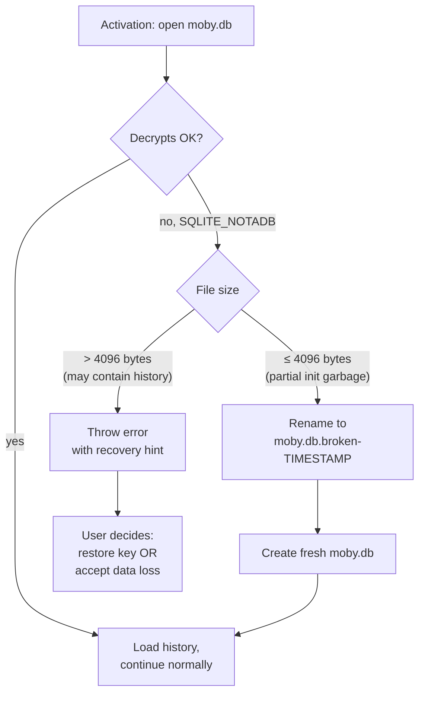
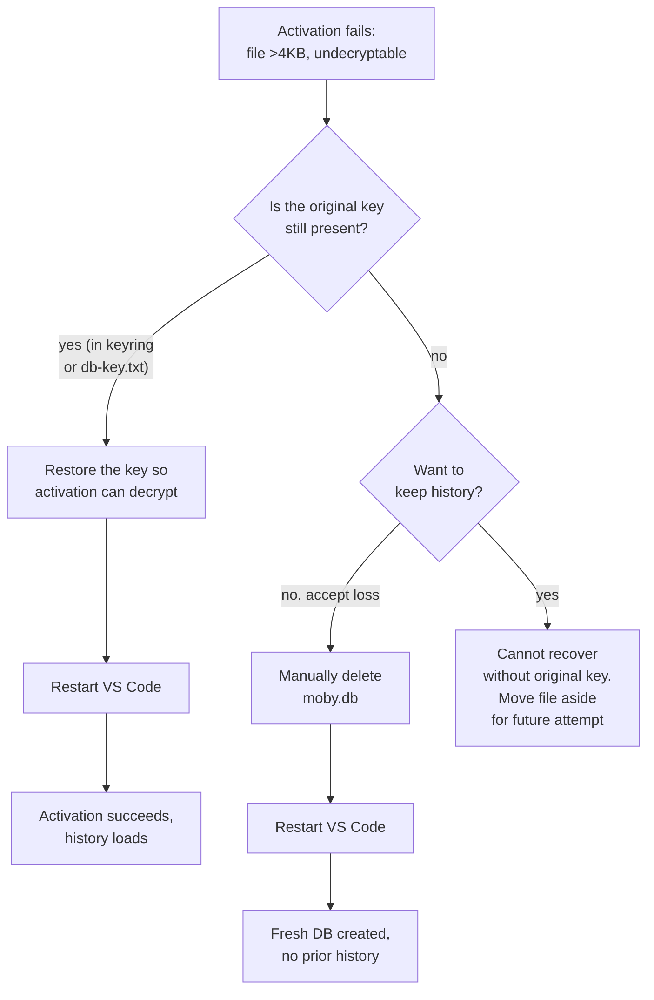

# Recovering from a corrupt database

Moby stores conversation history in an encrypted SQLite (SQLCipher) database. On rare occasions activation can fail with errors like `SQLITE_NOTADB: file is not a database`. This guide explains what's happening, what Moby does automatically, and what you can do when manual recovery is needed.

## When this matters

You'll see this only if the database file ends up in a state Moby can't decrypt. Two common causes:

- **Crashed first activation.** The extension created `moby.db` but crashed before initializing it. The file is partial — usually a few bytes — and can't be decrypted.
- **Encryption key changed.** The system Keychain / Credential Manager was wiped, you reinstalled the OS, or the secret was deleted some other way. The DB file is real but the key Moby has now is different from the one it was encrypted with.

## What Moby does automatically

On startup, Moby tries to open the database. If decryption fails, it inspects the file size before deciding what to do:



The 4096-byte threshold is SQLite's default page size. Anything smaller cannot structurally hold any user data, so it's safe to discard. Anything larger could contain real conversation history and is never deleted automatically.

## Scenario A — Auto-recovered (≤4096 bytes)

You don't need to do anything. Moby renames the broken file and starts fresh.

**What you'll see:**

- Moby activates normally.
- A `moby.db.broken-1714458930000` file appears next to `moby.db` (timestamp is when recovery happened).
- No prior conversation history.

**What it means:** the broken file was too small to hold conversations, so nothing was lost. The quarantined `.broken-*` file is preserved in case a developer wants to investigate; safe to delete once you're up and running.

## Scenario B — Manual intervention required (>4096 bytes)

Moby refuses to start and shows an error like:

```
Database file at /path/to/moby.db cannot be decrypted (SQLITE_NOTADB: file is not a database).
File size is 73728 bytes — too large to auto-discard, may contain conversation history.
Run "Moby: Manage Database Encryption Key" to restore the key, or back up and delete the file
manually to start fresh.
```

The file may contain real conversation history encrypted with a key Moby no longer has. The error hint points at the **Moby: Manage Database Encryption Key** command, but be aware of an important limitation: that command operates on an *already-open* database (it re-encrypts a working DB via `rekey`). It cannot open or decrypt a file that failed to decrypt, and because activation aborts before commands are registered, the command isn't even available after a failed startup. Recovery therefore hinges entirely on whether Moby still holds the original key:



### Path 1: Restore the encryption key

Moby derives the database key from VS Code SecretStorage (the OS keyring, under the secret `deepseek-moby.db-encryption-key`), falling back to a `db-key.txt` file in global storage when SecretStorage is unavailable. The DB only decrypts on the next activation if Moby can read back the *same* key it encrypted with.

1. If you exported a copy of the key earlier, put it back where Moby reads it: store it under `deepseek-moby.db-encryption-key` in SecretStorage, or place it in `db-key.txt` in the global-storage folder (paths below).
2. Restart VS Code so activation re-runs with the restored key.

The **Manage Database Encryption Key** command does *not* have a "paste the old key to decrypt" flow — its options are **Copy Current Key**, **Set Custom Key**, and **Generate New Key**, and the latter two only *re-encrypt a database that is already open*. So they can't rescue a file that won't decrypt, and the command can't run anyway once activation has aborted.

If your key was wiped from the keyring and you don't have a backup, this path is closed — there's no way to brute-force a SQLCipher key.

### Path 2: Accept data loss, start fresh

1. Locate the database file (paths below).
2. Move or delete `moby.db` (and any `moby.db-wal` / `moby.db-shm` siblings).
3. Restart VS Code.
4. Moby activates with a fresh database. No prior history.

Optionally, keep the broken file as `moby.db.<date>.bak` in case you change your mind or want to attempt recovery later.

## Database file locations

Moby stores its database in VS Code's per-extension global storage:

| OS | Path |
|---|---|
| macOS | `~/Library/Application Support/Code/User/globalStorage/loganbresnahan.deepseek-moby/moby.db` |
| Linux | `~/.config/Code/User/globalStorage/loganbresnahan.deepseek-moby/moby.db` |
| Windows | `%APPDATA%\Code\User\globalStorage\loganbresnahan.deepseek-moby\moby.db` |
| WSL | `~/.vscode-server/data/User/globalStorage/loganbresnahan.deepseek-moby/moby.db` |

Each `moby.db` may be accompanied by `moby.db-wal` and `moby.db-shm` files (SQLite write-ahead log + shared memory). When deleting for a fresh start, remove all three.

If you've installed the extension into a non-default profile (e.g. when developing with `--profile=moby-dev`), the path includes the profile name under `globalStorage/`.

## What's in a `.broken-<timestamp>` file?

The exact bytes of whatever Moby found at the path before recovering. Quarantined for forensics, not used by Moby for anything afterward. Safe to delete whenever you've confirmed Moby is working.

If you want to investigate why activation crashed, you can inspect the file:

```sh
file moby.db.broken-1714458930000
xxd moby.db.broken-1714458930000 | head
```

A truly empty/garbage file shows zeros or random bytes. A real but undecryptable SQLCipher file shows recognizable SQLite header structure but encrypted page contents.

## Preventing this

- **Save your encryption key** when first activating Moby. The "Manage Database Encryption Key" command can copy the current key to your clipboard (**Copy Current Key**); store it somewhere safe (password manager, 1Password, etc.).
- **Don't manually edit `moby.db`.** Use the extension's commands.
- **Don't share the file across machines** — encryption key is per-machine by default. Use export/import flows if you need to migrate.

## Related

- [src/events/dbRecovery.ts](../../src/events/dbRecovery.ts) — the recovery logic.
- [src/events/ConversationManager.ts](../../src/events/ConversationManager.ts) — calls `openDbWithRecovery` at activation.
- [history-persistence.md](history-persistence.md) — how Moby stores conversations.
- [Manage Database Encryption Key command](../../src/extension.ts) — `moby.manageEncryptionKey`.
